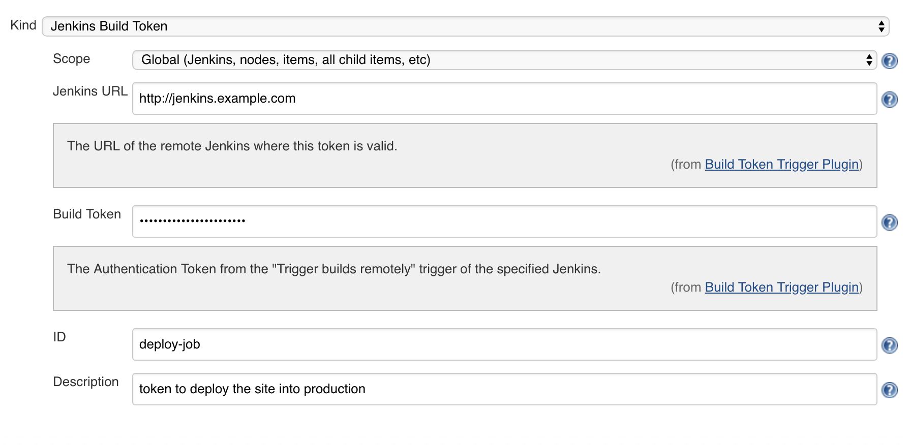
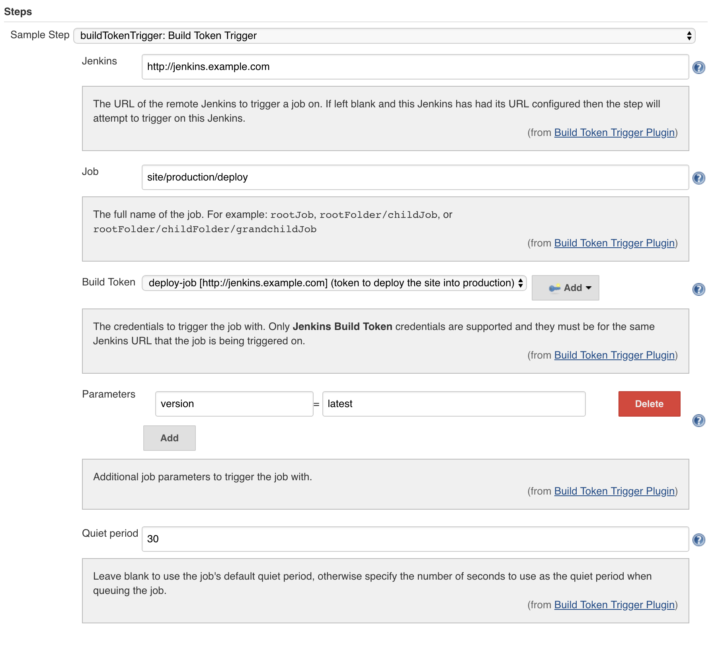
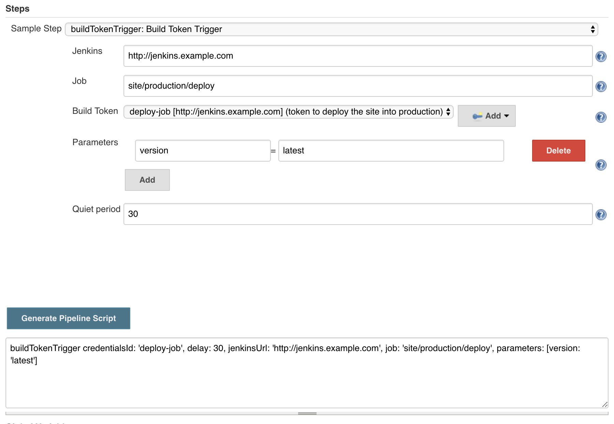

# Build Token Trigger Plugin documentation

## Using the plugin

The Jenkins that you want to trigger a build on must have the [Build Authorization Token Root](https://plugins.jenkins.io/build-token-root) plugin installed.

You need to create a *Jenkins Build Token* credentials that contains the token.



You can use the pipeline syntax Snippet Generator to prototype your step



Once you have the prototype step configured, click *Generate Pipeline Script* to generate the snippet:



The resulting pipeline step will look something like:

```
buildTokenTrigger credentialsId: 'deploy-job', delay: 30, jenkinsUrl: 'http://jenkins.example.com', job: 'site/production/deploy', parameters: [version: 'latest']
```

